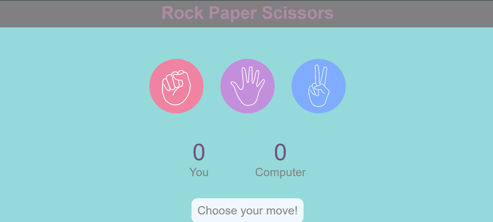
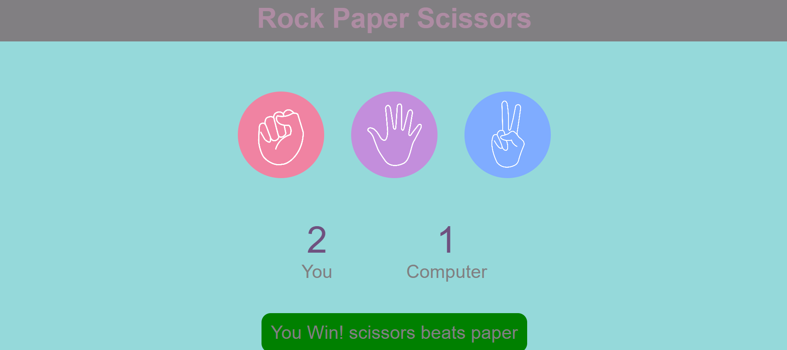

# Rock Paper Scissors

A simple and interactive **Rock Paper Scissors game** built using **HTML, CSS, and JavaScript**. The player competes against the computer, with automatic score tracking and result display.

## 🎮 Live Demo

Play the game directly in your browser:

👉 **[Play Rock Paper Scissors](https://YOUR-USERNAME.github.io/rock-paper-scissors/)**

> Replace `YOUR-USERNAME` with your GitHub username after enabling GitHub Pages.

## ✨ Features

- 🪨 Rock, Paper, and Scissors choices.
- 🤖 Computer generates a random choice.
- 🏆 Automatic winner detection.
- 📊 Score tracking for the player and computer.
- 🤝 Draw detection.
- 🎨 Interactive buttons with hover effects.
- 🖼️ Images are stored locally in the project.
- 📱 Simple and responsive interface.

## 🛠️ Technologies Used

- **HTML**
- **CSS**
- **JavaScript**

## 📸 Screenshots

### Game Interface



### Gameplay Result



## 📁 Project Structure

```text
rock-paper-scissors/
├── index.html
├── style.css
├── script.js
├── images/
│   ├── rock.png
│   ├── paper.png
│   └── scissors.png
├── Screenshot1.png
├── Screenshot2.png
└── README.md